Tolerance tol is used for checking co-planarity comparison. Delaunay means all possible co-planar Delaunay flips are performed.
Orig stands for original, mod stands for modified (after the flips).

You can click on the images to view full size.

| Method      | Co-planar Flips         | Energy Orig | Energy Mod | Texture Orig                                                              | Texture Mod                                                              |
| :---------: | :------------:          | :---------: | :--------: | :----------:                                                              | :---------:                                                              |
| ARAP, free  | 50206, tol=1e-8         | 0.28221     | 0.28228    | 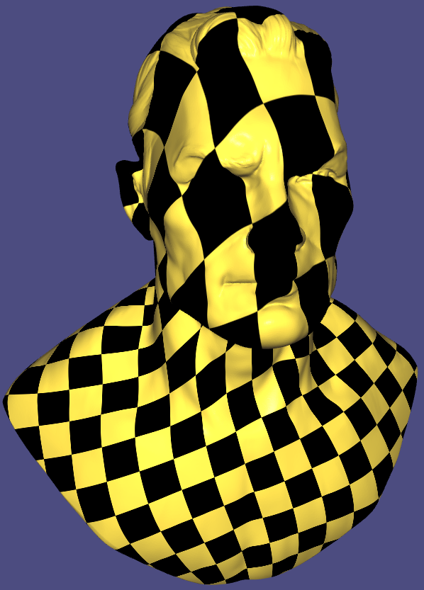     | 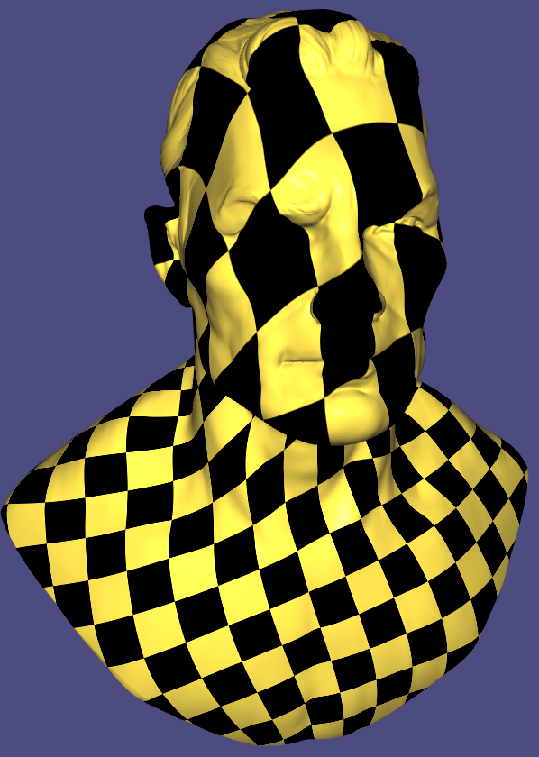     |
| ASAP        | 38766, tol=1e-9         | 5.13079     | 5.1197     | 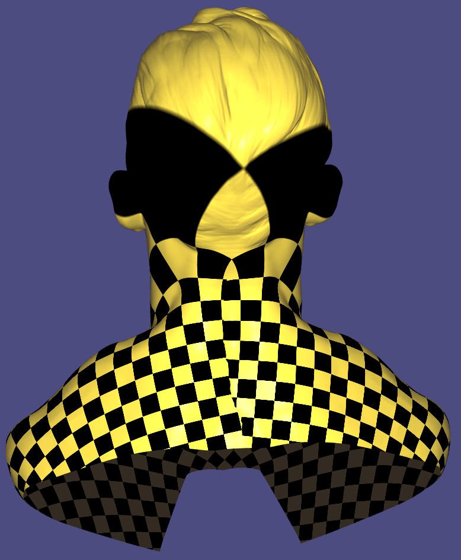     | 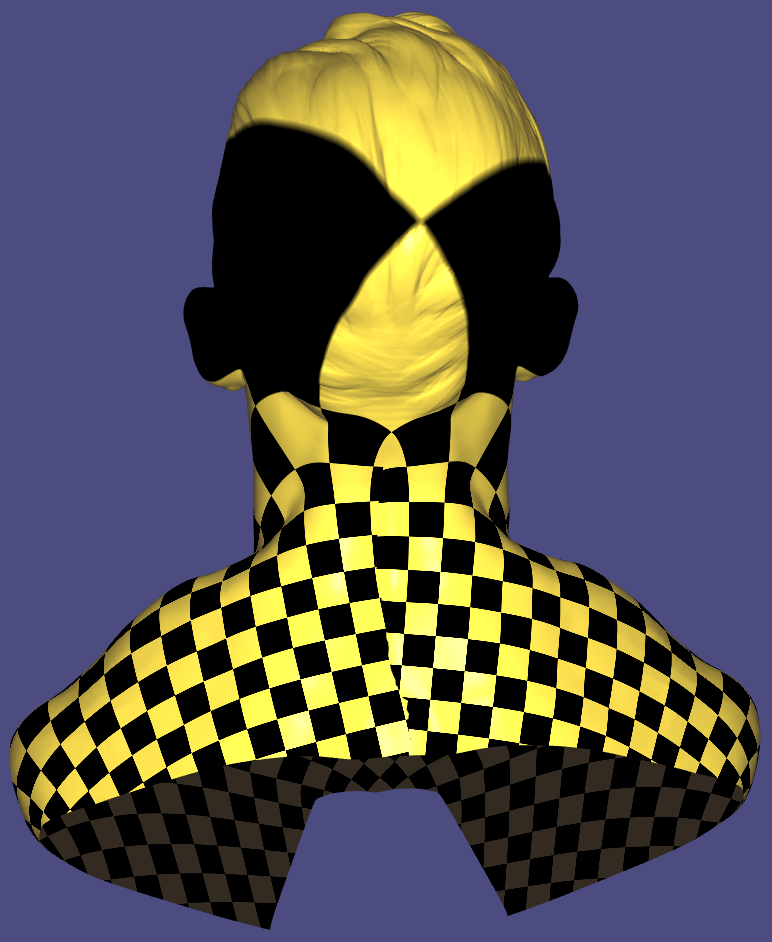     |
| ASAP        | 13209, tol=1e-8         | 4.62307     | 4.62755    | 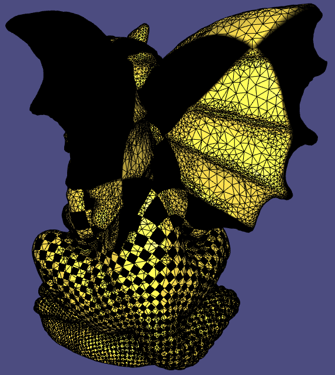     | 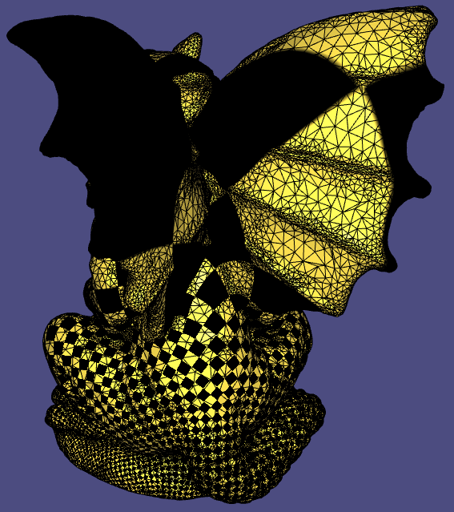     |
| Dirichlet   | 22575,  tol=1e-8        | 6.30999     | 6.31236    | 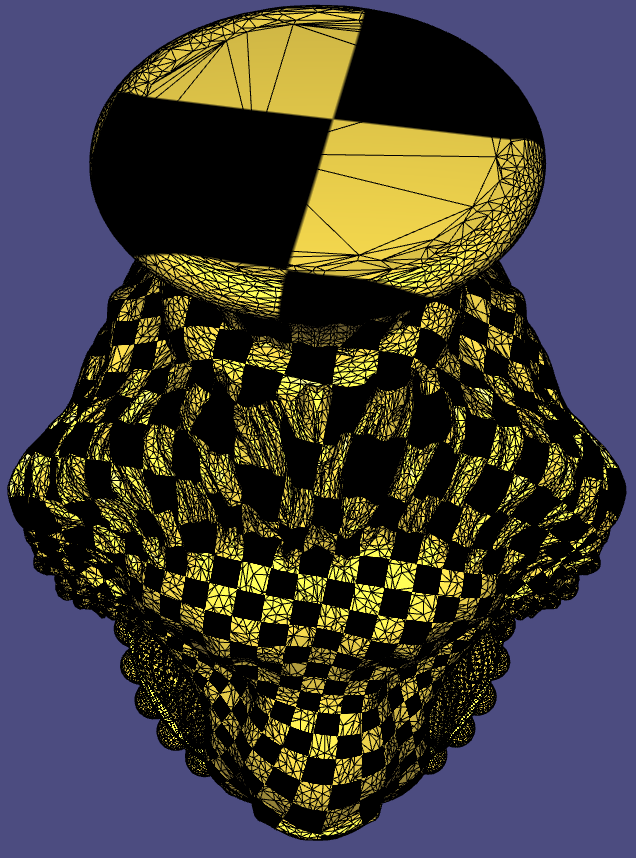 |  |
| ARAP, fixed | 22575,  tol=1e-8        | 2.90685     | 2.9089     | 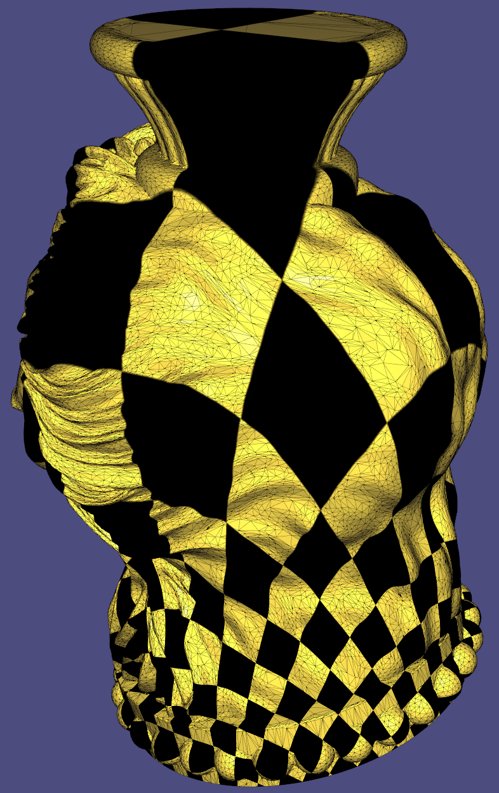     | 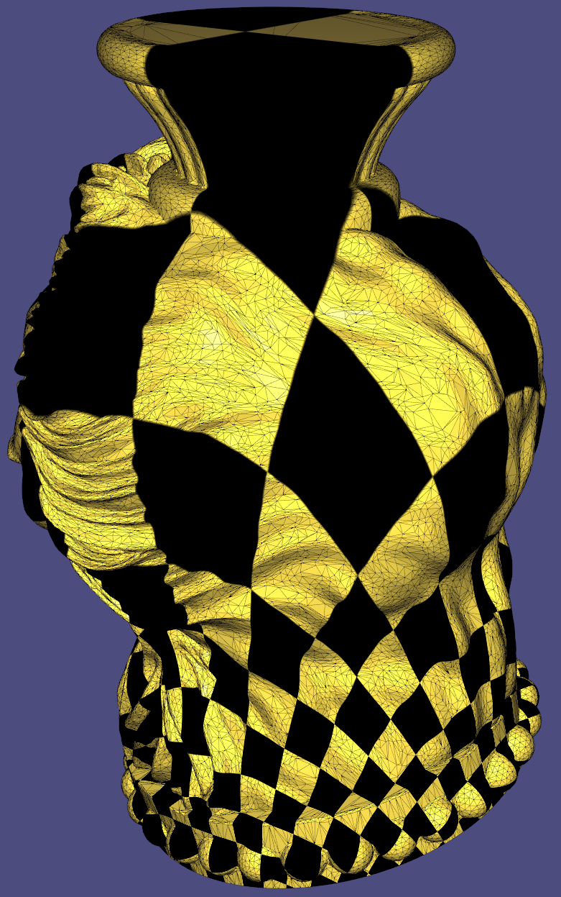     |
| ARAP, free  | 22575,  tol=1e-8        | 0.530081    | 0.530254   | 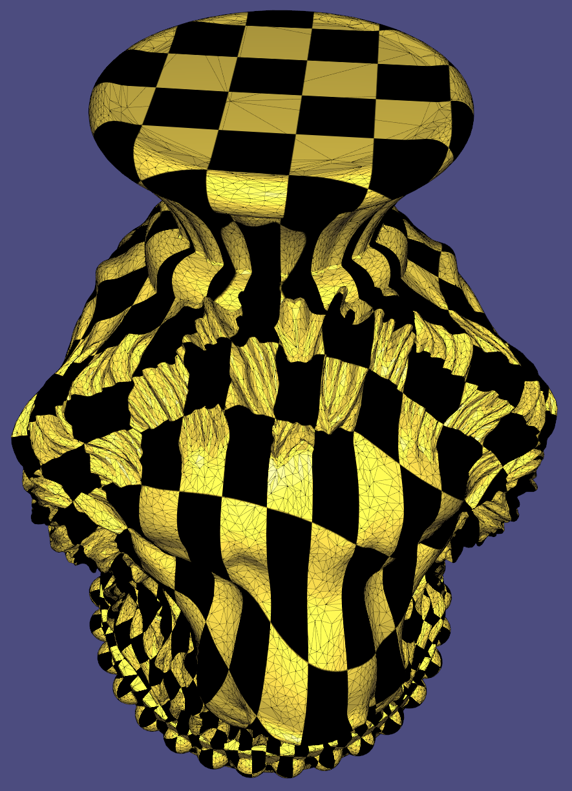     | 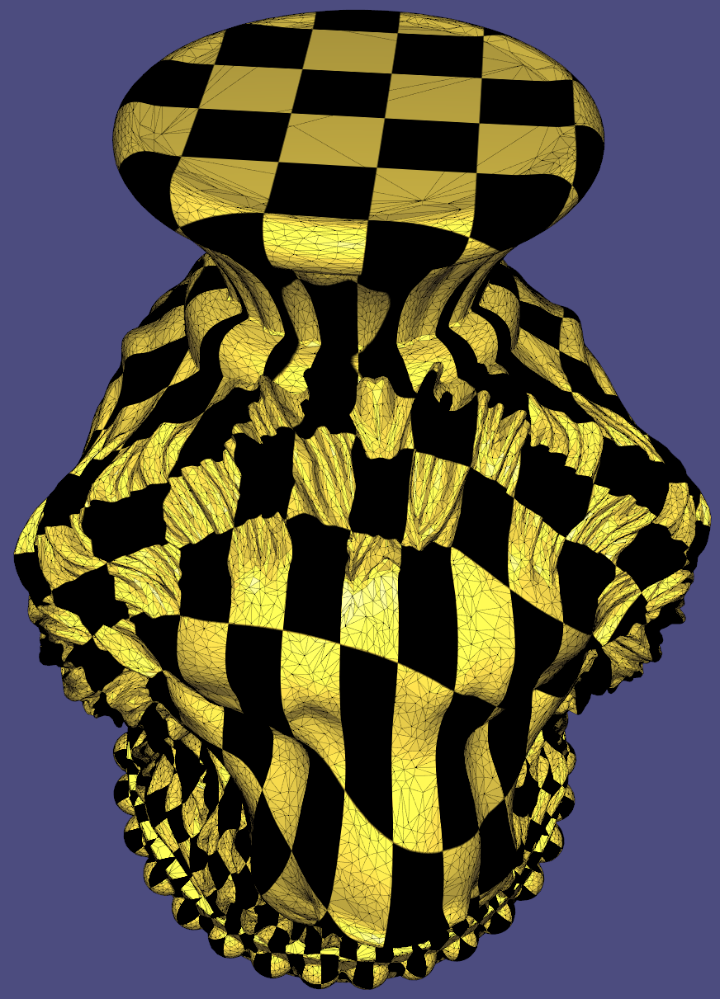     |
| Dirichlet   | 464, Delaunay, tol=1e-9 | 0.00012     | 0.00012    | 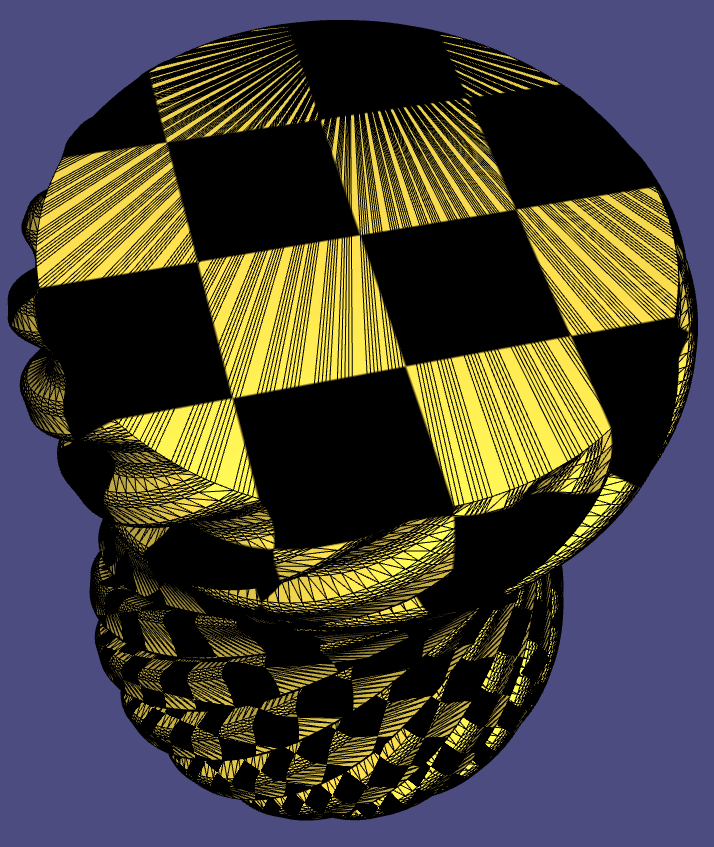 | 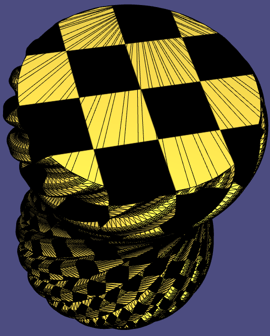 |
| ARAP, fixed | 2166, tol=1e-8          | 1.02528     | 1.02520    | 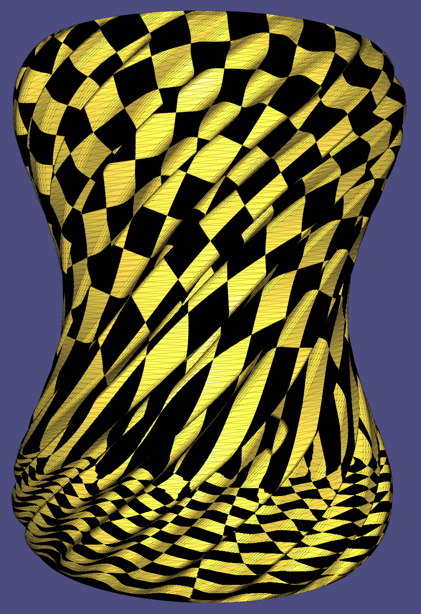       | 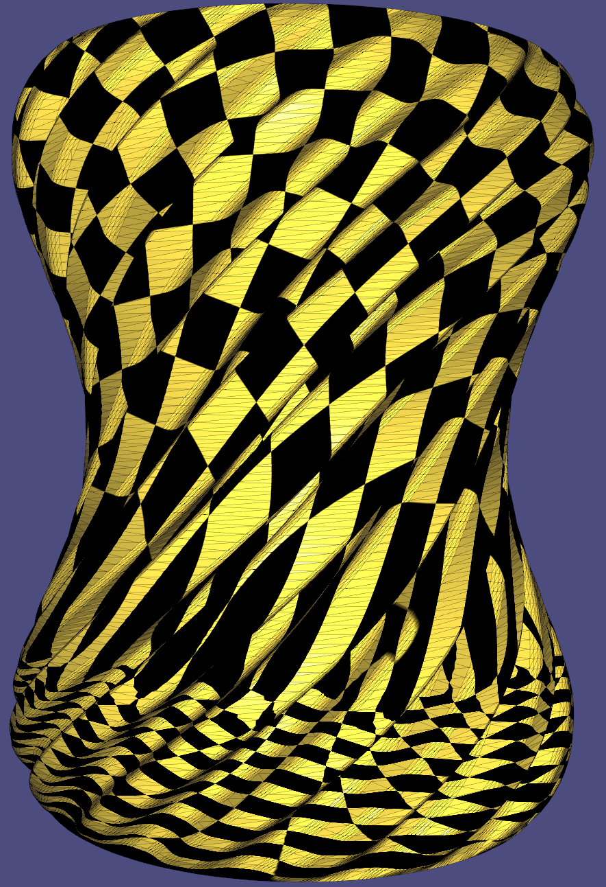       |
| Sym. Dirichlet  | 2166, tol=1e-8            | 5.24653| 5.24656    | 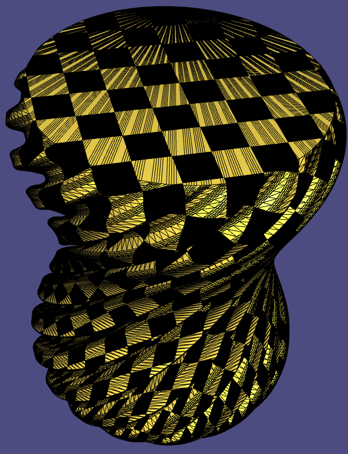 | 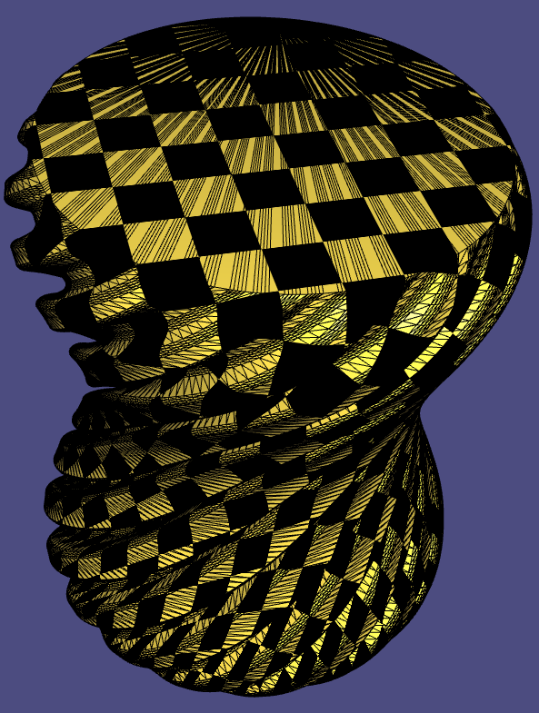 |
